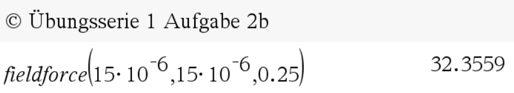
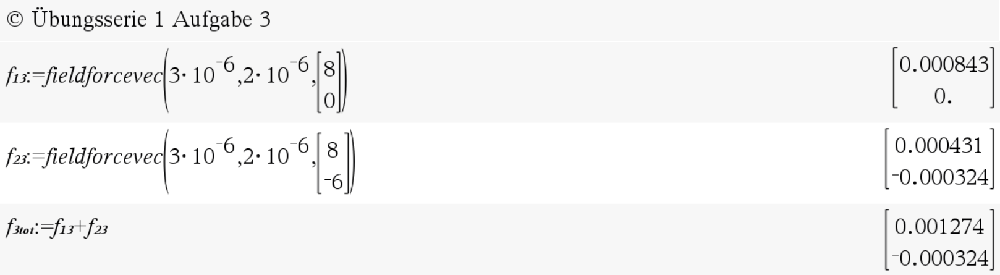

# PhysElekFunc <!-- omit in toc -->

This page shows all the available functions and some example implementations.

- [fieldforce(Q_1,Q_2,r)](#fieldforce)
- [fieldforcevec(Q_1,Q_2,r_12)](#fieldforcevec)

# fieldforce(Q_1,Q_2,r)

## Description: <!-- omit in toc -->

Returns the force [N] between the two given electric charges  
Input: Q_1 [C], Q_2 [C], r [m]

## Example: <!-- omit in toc -->

  
# fieldforcevec(Q_1,Q_2,r_12)

## Description: <!-- omit in toc -->

Returns the force vector [N] between the two given electric charges  
Input: Q_1 [C], Q_2 [C], r_12 [[m],[m]]

## Example: <!-- omit in toc -->
