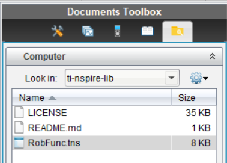
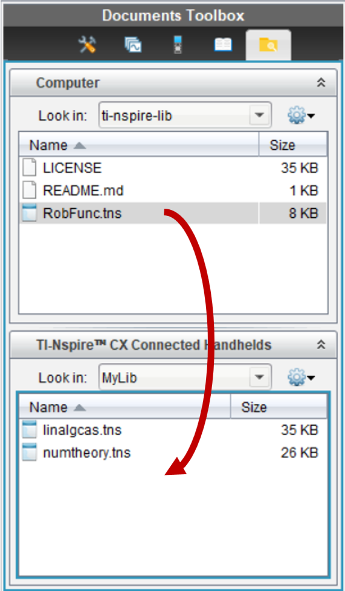
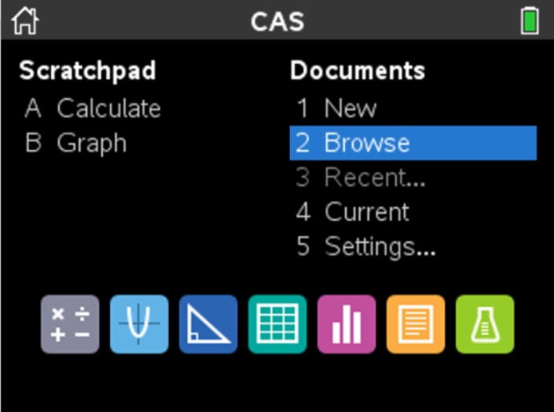
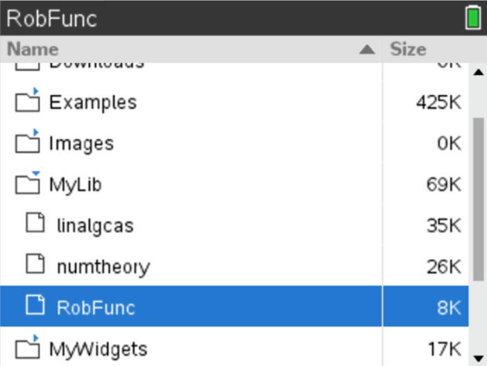
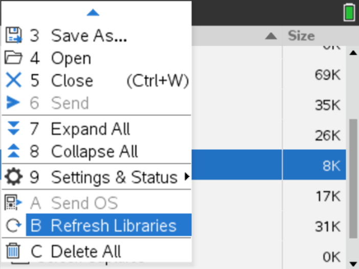
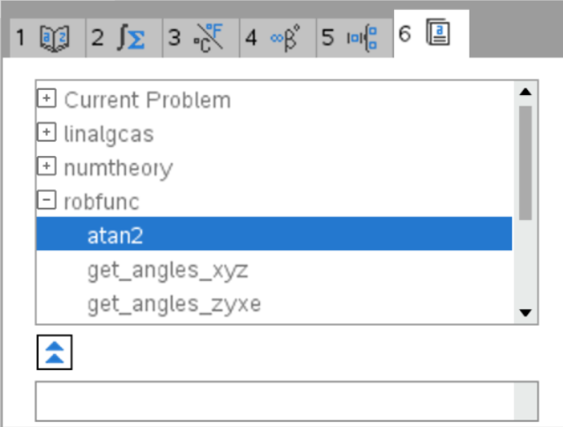

# ti-nspire-lib <!-- omit in toc -->

This repository contains different TI-Basic libraries with usefull functions. The code was developed for a TI-nspire CX II-T. Altrough the methodes are tested there is no guarantee for correctness, accuracy or completeness of the output.

## Table of content <!-- omit in toc -->

- [Libraries](#libraries)
  - [RobFunc](#robfunc)
- [Usage](#usage)
- [License](#license)

## Libraries
### RobFunc
This library was developed for the robotics module 2021 at OST 
* atan2(y,x)
* xyz_rotmat(a,b,g)
* zyx_e_rotmat(a,b,g)
* zyz_e_rotmat(a,b,g)
* xyz_angles(rmat)
* zyx_e_angles(rmat)
* zyz_e_angles(rmat)
* rotmat_x(phi)
* rotmat_y(beta)
* rotmat_z(alpha)
* transmat_rot_x(phi)
* transmat_rot_y(beta)
* transmat_rot_z(alpha)
* transmat_transl(a,b,c)
* dh_transmat(a,alpha,d,theta)

## Usage
This section explains how to use the libraries on your TI-nspire CX II-T
1. Download this repository or just the spezific tns file ou like to use.
2. Connect your calculator to your computer and start the TI-Nspire CX CAS Student software.
3. Navigate to the folder where you saved the repository.  
   
4. Copy the .tns files to the MyLib folder on your calculator  
     
5. Press the ON button on your calculator and brows to the MyLib folder  
     
   
6. Select the library you want to install and press the MENU button  
   
7. Select the Refresh Libraries option.
8. The library is now in all your documentes available
   1. Open a new document
   2. Press the library button 
   3. Now you can see the functions in the section 6  
      

## License
This repository is licensed under the terms of the [GNU GENERAL PUBLIC LICENSE V3](LICENSE) license.
