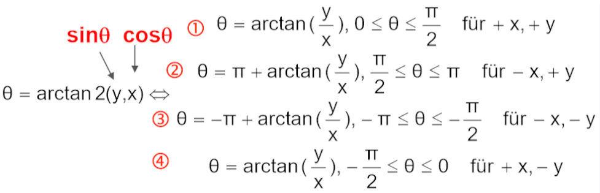
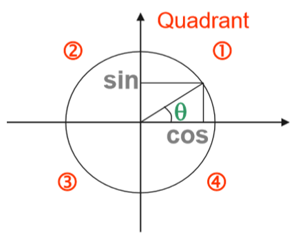
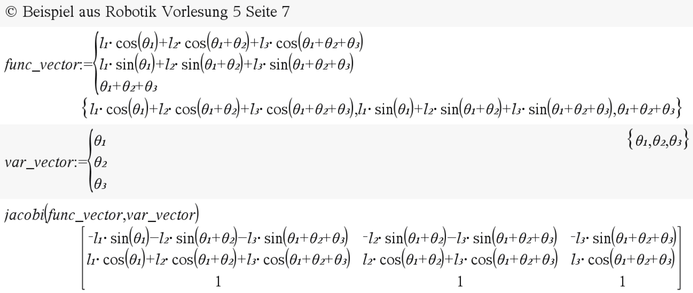
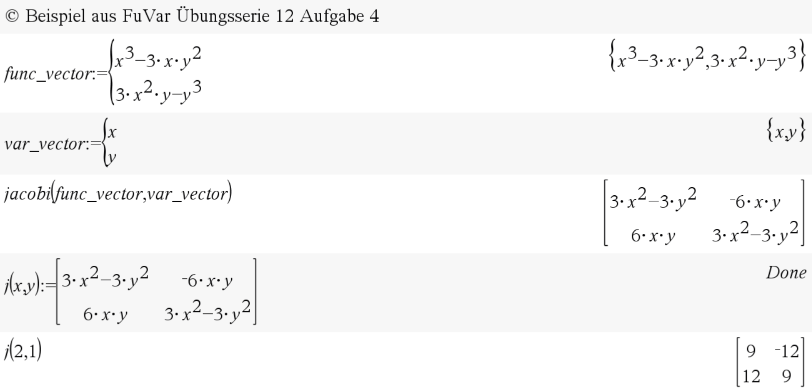

# RobFunc <!-- omit in toc -->

This page shows all the available functions and some example implementations.

- [atan2(y,x)](#atan2yx)
- [xyz_rotmat(a,b,g)](#xyz_rotmatabg)
- [zyx_e_rotmat(a,b,g)](#zyx_e_rotmatabg)
- [zyz_e_rotmat(a,b,g)](#zyz_e_rotmatabg)
- [xyz_angles(rmat)](#xyz_anglesrmat)
- [zyx_e_angles(rmat)](#zyx_e_anglesrmat)
- [zyz_e_angles(rmat)](#zyz_e_anglesrmat)
- [rotmat_x(gamma)](#rotmat_xgamma)
- [rotmat_y(beta)](#rotmat_ybeta)
- [rotmat_z(alpha)](#rotmat_zalpha)
- [transmat_rot_x(gamma)](#transmat_rot_xgamma)
- [transmat_rot_y(beta)](#transmat_rot_ybeta)
- [transmat_rot_z(alpha)](#transmat_rot_zalpha)
- [transmat_transl(a,b,c)](#transmat_translabc)
- [dh_transmat(a,alpha,d,theta)](#dh_transmataalphadtheta)
- [jacobi(funcvec,varvec)](#jacobifuncvecvarvec)

# atan2(y,x)

## Description: <!-- omit in toc -->

Returns the unequivocally arctangent of the given y and x values.  
Where:  
y=sin(θ) (opposite side / Gegenkathete)  
x=cos(θ) (adjacent side / Ankathete)

## Example: <!-- omit in toc -->

# xyz_rotmat(a,b,g)

## Description: <!-- omit in toc -->

Returns the rotation matrix with the "X-Y-Z Roll-Nick-Gier" method
Input: alpha, beta, gamma  
$(A-B)R = R_z(a)*R_y(b)*R_x(g)$  
World fix transformation  

1. Rotation around X-axis with angle gamma
2. Rotation around Y-axis with angle beta
3. Rotation around Z-axis with angle alpha

## Example: <!-- omit in toc -->

# zyx_e_rotmat(a,b,g)

## Description: <!-- omit in toc -->

Returns the rotation matrix with the "Z-Y-X Euler Angle" method  
Input: alpha, beta, gamma  
$(A-B)R = R_z(a)*R_y(b)*R_x(g)$  
Body fix transformation:

1. Rotation around Z-axis with angle alpha
2. Rotation around Y-axis with angle beta
3. Rotation around X-axis with angle gamma

## Example: <!-- omit in toc -->

# zyz_e_rotmat(a,b,g)

## Description: <!-- omit in toc -->

Returns the rotation matrix with the "Z-Y-Z Euler Angle" method  
Input: alpha, beta, gamma  
$(A-B)R = R_z(a)*R_y(b)*R_x(g)$  
Body fix transformation

1. Rotation around Z-axis with angle alpha
2. Rotation around Y-axis with angle beta
3. Rotation around Z-axis with angle gamma

## Example: <!-- omit in toc -->

# xyz_angles(rmat)

## Description: <!-- omit in toc -->

Returns the "X-Y-Z Roll-Nick-Gier" (alpha, beta, gamma) angles from the given rotation matrix.  
Input: rotation matrix  
$(A-B)R = R_z(a)*R_y(b)*R_x(g)$  
World fix transformation  

1. Rotation around X-axis with angle gamma
2. Rotation around Y-axis with angle beta
3. Rotation around Z-axis with angle alpha

## Example: <!-- omit in toc -->

# zyx_e_angles(rmat)

## Description: <!-- omit in toc -->

Returns the "Z-Y-X Euler Angle" (alpha, beta, gamma) angles from the given rotation matrix.  
Input: rotation matrix  
$(A-B)R = R_z(a)*R_y(b)*R_x(g)$  
Body fix transformation

1. Rotation around Z-axis with angle alpha
2. Rotation around Y-axis with angle beta
3. Rotation around X-axis with angle gamma

## Example: <!-- omit in toc -->

# zyz_e_angles(rmat)

## Description: <!-- omit in toc -->

Returns the "Z-Y-Z Euler Angle" (alpha, beta, gamma) angles from the given rotation matrix.  
Input: rotation matrix  
$(A-B)R = R_z(a)*R_y(b)*R_x(g)$
Body fix transformation

1. Rotation around Z-axis with angle alpha
2. Rotation around Y-axis with angle beta
3. Rotation around Z-axis with angle gamma

## Example: <!-- omit in toc -->

# rotmat_x(gamma)

## Description: <!-- omit in toc -->

Returns the rotation matrix of a rotation around the x-axis

## Example: <!-- omit in toc -->

# rotmat_y(beta)

## Description: <!-- omit in toc -->

Returns the rotation matrix of a rotation around the y-axis

## Example: <!-- omit in toc -->

# rotmat_z(alpha)

## Description: <!-- omit in toc -->

Returns the rotation matrix of a rotation around the z-axis

## Example: <!-- omit in toc -->

# transmat_rot_x(gamma)

## Description: <!-- omit in toc -->

Returns the transformation matrix of a rotation around the x-axis

## Example: <!-- omit in toc -->

# transmat_rot_y(beta)

## Description: <!-- omit in toc -->

Returns the transformation matrix of a rotation around the y-axis

## Example: <!-- omit in toc -->

# transmat_rot_z(alpha)

## Description: <!-- omit in toc -->

Returns the transformation matrix of a rotation around the z-axis

## Example: <!-- omit in toc -->

# transmat_transl(a,b,c)

## Description: <!-- omit in toc -->

Returns the transformation matrix of a translation with x=a, y=b, z=c

## Example: <!-- omit in toc -->

# dh_transmat(a,alpha,d,theta)

## Description: <!-- omit in toc -->

Returns the Denavit-Hartenberg transformation matrix  
Input: a_i, α_i, d_i, θ_i

## Example: <!-- omit in toc -->
  
# jacobi(funcvec,varvec)

## Description: <!-- omit in toc -->

Returns the Jacobi-Matrix of the given function vector and variable vector  
Input:  
funcvec := {f1(x,y,...), f2(x,y,...), ...)}  
varvec := {x,y,...}  

Output = $
\left(\begin{array}{cc}
df1/dx & df1/dy & df1/d...\\
df2/dx & df2/dy & df2/d...\\
df.../dx & df.../dy & df.../d...\\
\end{array}\right)
$

## Example: <!-- omit in toc -->

